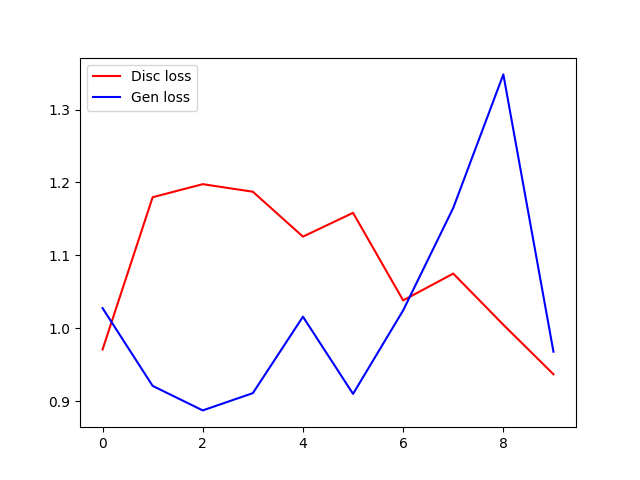

# Tested on:
> python 3.5 and TF 1.3

# To run
Different versions are given. The difference between the versions: little mods in the
Generator and/or the Discriminator net.

## This is the best:
```
$ python main_v0.py
```
Outputs are in "pics" folder. Examples:

After 1st epoch - more or less on radom 10 input in columns


After 5th epoch - more or less on radom 10 input in columns


Final - on radom 100 input


Losses



## The rest are worse, for pedagogical reasons:
```
$ python main_v1.py
$ python main_v2.py
$ python main_v3.py
$ python main_v4.py
$ python main_v5.py
```
# Links

- (https://arxiv.org/pdf/1701.00160.pdf)
- (https://www.tensorflow.org/api_guides/python/nn#Convolution)
- (http://stackoverflow.com/questions/39373230/what-does-tensorflows-conv2d-transpose-operation-do)
- (http://deeplearning.net/software/theano_versions/dev/tutorial/conv_arithmetic.html#no-zero-padding-unit-strides-transposed)
